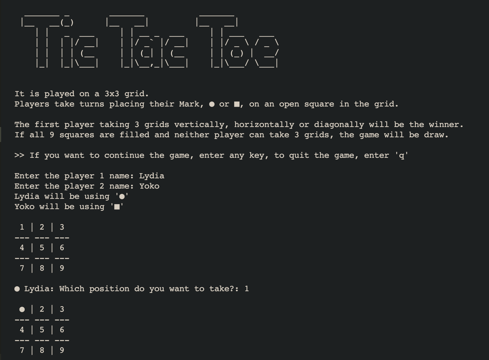

# Tic-Tac-Toe-Game

​
## About the Project
​
This project is to build a Tic Tac Toe game which can be played on the command line.
Two human players can play against each other and the board is displayed in between turns.
We built this project following some requirements: 
​
- The main.rb file should be responsible for user interaction, and this is the only place where puts/print and get.chomp can be used
- Comply with [DRY](https://en.wikipedia.org/wiki/Don%27t_repeat_yourself) rule
- Set the permission for reading and writing with attr_accessor, attr_reader properly to Classes
- Include the validation for user's inputs to correspond to unpredictable behavior from players
​
​
## Table of Contents
* [About the Project](#about-the-project)
* [Built With](#built-with)
* [Live Demo](#live-demo)
* [Getting Started](#getting-started)
* [About Tic Tac Toe](#about-tic-tac-toe)
* [How to Play](#how-to-play)
* [Contributing](#contributing)
* [Authors](#authors)
* [Acknowlegments](#acknowlegments)
* [Show your support](#show-your-support)
* [License](#license)
​
## Built With
* [Ruby](https://www.ruby-lang.org/en/)

## Live Demo

[Live demo](https://repl.it/@yocoono/Tic-Tac-Toe-Game#main.rb)
​
​
## Getting Started
​
To get a local copy up and running follow these simple example steps.
​
1. On the project GitHub page, navigate to the main page of the repository.
2. Under the repository name, locate and click on a green button named `Code`. 
3. Copy the project URL as displayed.
4. If you're running the Windows Operating System, open your command prompt. On Linux, Open your terminal. 
5. Change the current working directory to the location where you want the cloned directory to be made. Leave as it is if the current location is where you want the project to be. 
6. Type git clone, and then paste the URL you copied in Step 3.  
e.g. $ git clone https://github.com/yourUsername/yourProjectName 
7. Press Enter. Your local copy will be created. 
8. Go into the folder you cloned in this step 7 on your terminal
e.g. $ cd Desktop/Tic-Tac-Toe-Game
9. Type `bin/main.rb` to run the code, and then the game starts!
​
​
## About Tic Tac Toe
​
Tic Tac Toe is a simple game for 2 players, ● and ■. 
It is played on a 3x3 grid. 
Players take turns placing their Mark, ● or ■, on an open square in the grid. 
The first player to take 3 grids vertically, horizontallyor diagonally will be the winner.
If all 9 squares are filled and neither player can take 3 grids, the game will be draw.
​
​
## How to play
1. To start the game, input any key
2. Enter the player's names
3. Take a look at the board 
4. Input the number from 1 to 9 to get the position where you want to take
5. Taking turns to play the game with step 3 and 4
6. If either player take 3 grids vertically, horizontally or diagonally first, the player is the winner
7. If neither player can take 3 grids until the board is filled with players' symbols, the game is in tie
8. If you want to play again, enter any key, otherwise, enter 'q' to quit the game
​
​
## Contributing
​
Contributions, issues, and feature requests are welcome!
Feel free to check the [issues page](../../issues).
​
1. Fork the Project
2. Create your Feature Branch (`git checkout -b feature/AmazingFeature`)
3. Commit your Changes (`git commit -m 'Add some AmazingFeature'`)
4. Push to the Branch (`git push origin feature/AmazingFeature`)
5. Open a Pull Request
​
​
## Authors
​
👤 **Delice Lydia**
​
- Github: [@DeliceLydia](https://github.com/DeliceLydia)
- Twitter: [@IngabireLydia3](https://twitter.com/IngabireLydia)
- Linkedin: [Delice Lydia](https://www.linkedin.com/in/delice-lydia)
​

👤 **Yoko Saka**
​
- GitHub: [@yocosaka](https://github.com/yocosaka)
- Twitter: [@yocosaka](https://twitter.com/yocosaka)
- LinkedIn: [Yoko Saka](https://www.linkedin.com/in/yokosaka)

## Acknowlegments

Special Thanks to the [Odin Project](https://www.theodinproject.com/courses/ruby-programming/lessons/tic-tac-toe)

## Show your support
​
Give a ⭐️ if you like this project!
​
## License
​
This project is [MIT](./LICENSE.txt) licensed.
